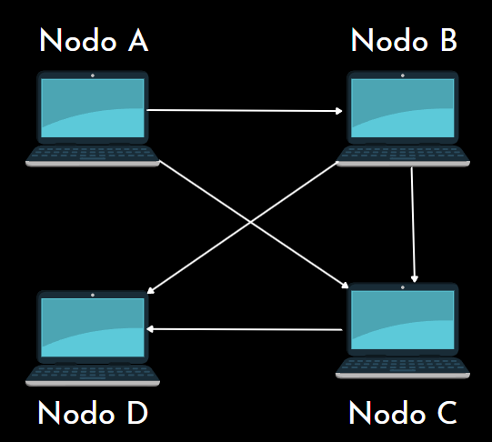

.. P2P-Summation-System documentation master file, created by
   sphinx-quickstart on Thu Dec  2 22:38:18 2021.
   You can adapt this file completely to your liking, but it should at least
   contain the root `toctree` directive.

Bienvenido a la documentacion de P2P-Summation-System's!
=========================================================
El siguiente programa se realizo para la materia de Sistemas distribuidos,
utilizando Python, y Docker para simular una red de iguales a iguales (peer to peer),
donde cada nodo es el mismo código que va realizar una suma.

¿Qué es?
========
El sistema de suma P2P es un sistema basado en nodos iguales los cuales trabajan bajo el modelo peer to peer. 
Cada nodo es capaz de almacenar números, recuperar la suma de cada nodo, sin mencionar que es capaz de proporcionar 
información de el a treves de diferentes servicios web, mediados por APIs realizadas mediante Flask con Python.

¿Cómo funciona?
===============
Este sistema funciona gracias a un conjunto de 3 reglas que evitan que los pares terminen de manera indefinida o en bucles.

Regla #1 
--------
No realizar peticiones de suma de red a quien me realizo la petición de suma

Regla #2 
--------
No realizar peticiones de suma a los vecinos de quien me realiza la petición de suma (Peticionario)

Regla #3
-------- 
No responde a peticiones ya identificadas, y con respuestas

.. Note:: Los nodos que generan las solicitudes y sus identificaciones son nombrados master, por los no iguales, el resto de nodos no tienen tipo, solamente no son master.

Topología de red usada para la simulación (Malla)
-------------------------------------------------

Usando P2P-Sumation-System
===========================
Para utilizar este programa, es necesario tener Docker, un entorno virtual de Python y crear varios contenedores
de Docker con imágenes de Python, aunque no es necesario tener varios nodos, es lo recomendable para ver el completo
funcionamiento .

Empezando a usar P2P
=====================
Para comenzar inicie clonando el siguiente repositorio publicando en Github con todo el código del proyecto.
``Repository: https://github.com/NilsonVargas/p2p-summation-system``

.. Note:: Para empezar, deberia tener ``Python en una version 3.6.0 o superior`` antes de correr
   los siguientes comandos.

Creando el entorno virtual
===========================

Linux
-----
>>> (bash) python3 -m venv name_env

Activar el entorno virtual

>>> (bash) cd name_env && source bin/activate

Windows
-------

>>> python -m venv name_env

Ahora, entre al entorno virtual y activelo

>>> cd name_env/Scripts && activate
   
Instale las dependencias del proyecto dentro del entorno virtual utilizando el siguiente comando

>>> (env) cd CryptoSD && pip install -r requirements.txt

y si descarga nueva dependencias, actualice el archivo de requirement.txt

>>> (env) pip freeze > requirements.txt

.. Note:: Actualiza el archivo requirements.txt siempre en la raiz del proyecto.

Ejecutando el programa
=======================
Una vez, tenga los entornos virtuales es necesario establecer todo el sistema de Docker
donde es importante tener en cuenta las direcciones y la red propia creada en Docker.

>>> (env) python main.py
Figura de ejemplo corriendo un script de python: python nombre_componente.py

.. toctree::
   :maxdepth: 1
   :caption: Contents:

   Controlador
   HttpSolicitud
   Nodo
   service_main

Indices and tables
==================

* :ref:`genindex`
* :ref:`modindex`
* :ref:`search`
